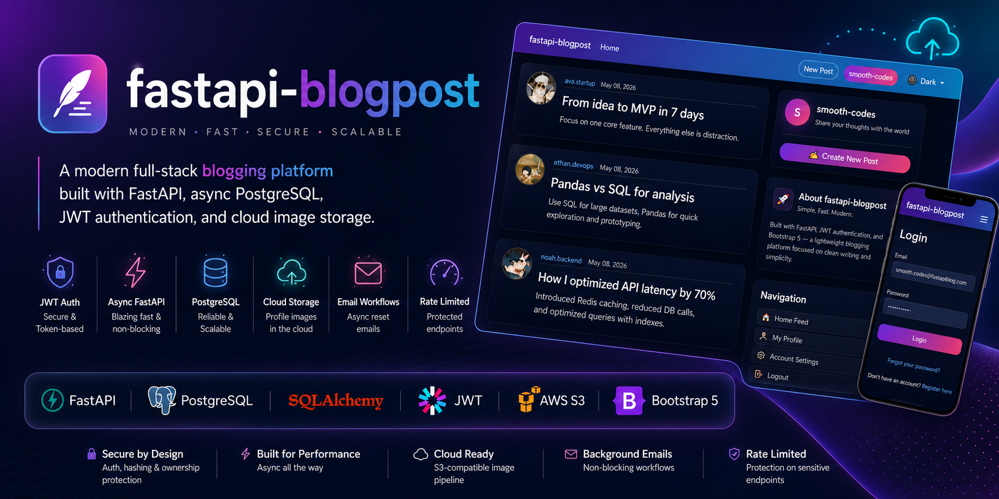
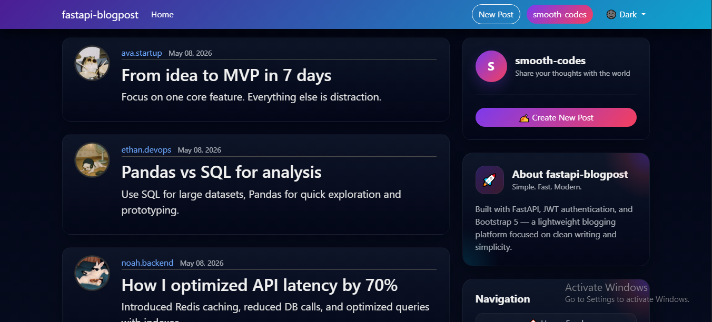
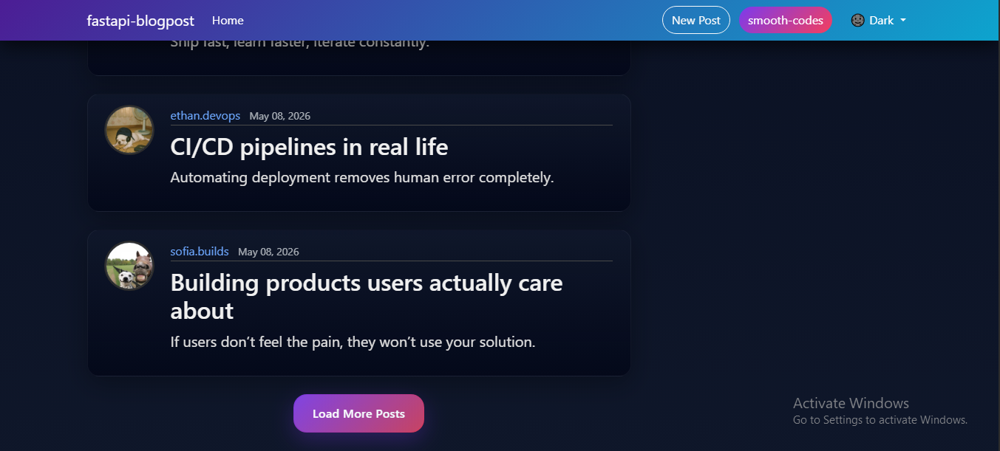
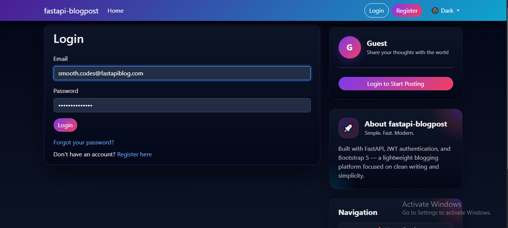
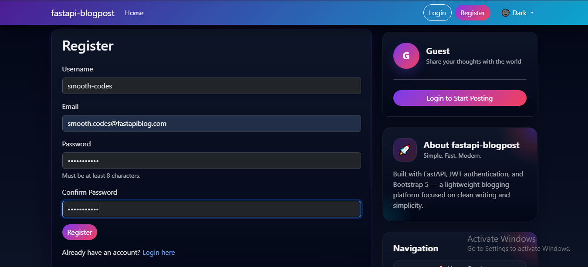
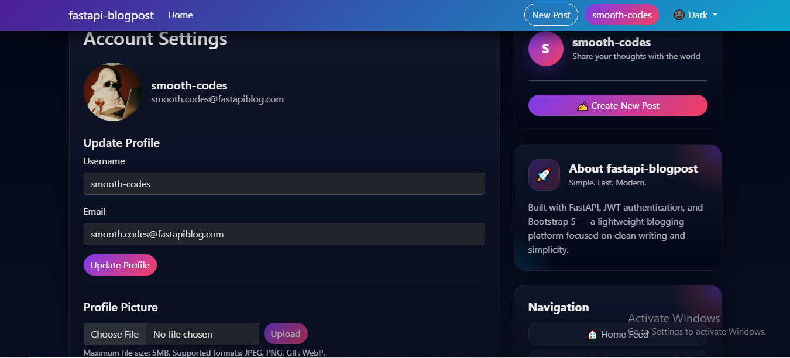

<p align="center">
  
</p>

<h1 align="center">fastapi blogpost</h1>

<p align="center">
  <strong>A modern full-stack blogging platform built with FastAPI, async PostgreSQL, JWT authentication, and cloud image storage.</strong>
</p>

<p align="center">
  <a href="https://fastapi-blogpost-project.onrender.com">
    
  </a>
  &nbsp;
  <a href="https://github.com/mrSm00th/fastapi-blogpost">
    
  </a>
</p>

<p align="center">
  
  
  
  
  
  
</p>

---

## 📸 Screenshots

| Home Feed | Pagination |
|:---------:|:---------:|
|  |  |

| Login | Register | Account Settings |
|:-----:|:--------:|:----------------:|
|  |  |  |


---
## ⚡ TL;DR — Key Backend Features

> This project was built to explore backend concepts beyond basic CRUD applications.

| | What's implemented | Why it matters |
|---|---|---|
| 🔐 | **JWT authentication + hashed password reset tokens** | Secure user authentication and reset workflows |
| ⚡ | **Fully async backend** — FastAPI, SQLAlchemy Async, aiosmtplib | Handles database, API, and email operations asynchronously |
| 🛡️ | **Route-level rate limiting** on sensitive endpoints | Helps reduce abuse and brute-force attempts |
| ☁️ | **Cloud image pipeline** — validation → Pillow processing → S3-compatible uploads | Practical file handling and cloud storage integration |
| 🔒 | **Ownership-based authorization** | Users can only modify or delete their own content |
| 📧 | **Background email workflows** with HTML templates | Password reset emails don't block incoming requests |
| 📄 | **Paginated REST API responses** | Cleaner and scalable post fetching |
| 🏗️ | **Structured backend architecture** — routers, services, schemas, ORM layers | Keeps the project modular and easier to maintain |

---

## 📖 Overview

**fastapi blogpost** is a full-stack blogging platform built while learning backend engineering concepts like authentication, async APIs, cloud storage, and secure user workflows.. It covers the complete user lifecycle — from registration and JWT-authenticated sessions through post creation, cloud image uploads, and password recovery — all wrapped in a responsive UI with dark/light mode support.

This project started as a backend learning project and gradually evolved into a full-stack application with authentication, async APIs, cloud image uploads, and security-focused user workflows.

---


## ✨ Feature Highlights

### 🔐 Authentication & Security
- JWT access tokens with expiration
- Secure password hashing (never stored in plain text)
- Full password reset flow — token generation, SHA-256 hashing, expiration, and invalidation
- Account enumeration prevention
- Ownership-based authorization on all sensitive routes
- HTTP security headers, referrer policy, and HSTS support

### 📝 Posts
- Create, edit, partially update, and delete posts
- Paginated feed with user-specific filtering
- `selectinload()` relationship optimization for efficient author queries

### 👤 User Management
- Registration, login, username/email/password updates
- Profile picture upload, replacement, and deletion
- Full account deletion support

### ☁️ Cloud Image Pipeline
- File size and format validation (JPEG, PNG, GIF, WebP)
- Pillow-based image processing in async threadpool
- Upload to S3-compatible storage with automatic old-image cleanup

### 📧 Email Workflows
- Async SMTP delivery via `aiosmtplib`
- HTML templates with plain-text fallback
- Password reset emails processed as background tasks

### ⚡ Performance
- Fully async FastAPI endpoints
- Non-blocking SQLAlchemy async sessions
- Background tasks for email delivery
- Efficient paginated queries

### 🛡️ Rate Limiting

| Endpoint | Limit |
|----------|-------|
| Login | `5 / 10 min` |
| Register | `3 / hour` |
| Post Creation | `3 / 10 min` |
| Password Reset | `3 / hour` |
| Account Deletion | `2 / day` |

### 🌗 UI & UX
- Dark / Light / Auto theme switching
- Responsive Bootstrap 5 layout
- Gradient-based visual identity
- Toast notifications
- Mobile-friendly sidebar navigation

---

## 🏗️ Architecture

```
Client (Bootstrap 5 + JavaScript)
        │
        ▼
FastAPI Application
        │
        ├── API Routers (users.py / posts.py)
        │         │
        │         ▼
        ├── Auth & Validation Layer (JWT / Pydantic / Ownership)
        │         │
        │         ▼
        ├── Service Layer (Image Processing / Email / Security)
        │         │
        │         ▼
        └── Async SQLAlchemy ORM → PostgreSQL

External Services
  ├── AWS S3 / Supabase Storage  (profile images)
  └── SMTP Provider              (password reset emails)
```

### Project Structure

```
fastapi blogpost/
├── app/
│   ├── core/
│   │   ├── auth.py          # JWT, hashing, user resolution
│   │   ├── config.py        # Environment config
│   │   └── limiter.py       # SlowAPI rate limiter setup
│   ├── db/
│   │   ├── database.py      # Async engine & session
│   │   └── models.py        # SQLAlchemy ORM models
│   ├── routers/
│   │   ├── users.py         # Auth, profile, account routes
│   │   └── posts.py         # CRUD post routes
│   ├── schemas/
│   │   └── schemas.py       # Pydantic request/response models
│   ├── services/
│   │   ├── email_utils.py   # SMTP email workflows
│   │   └── image_utils.py   # Pillow + S3 upload pipeline
│   ├── templates/
│   │   └── email/           # Jinja2 email templates
│   └── main.py
├── static/
├── assets/
├── requirements.txt
└── README.md
```

---

## 🌐 API Reference

### Authentication

| Method | Endpoint | Description |
|--------|----------|-------------|
| `POST` | `/api/users` | Register a new account |
| `POST` | `/api/users/token` | Login — returns JWT |
| `GET` | `/api/users/me` | Get current user |
| `PATCH` | `/api/users/me/password` | Change password |
| `POST` | `/api/users/forgot-password` | Send reset email |
| `POST` | `/api/users/reset-password` | Reset with token |

### Posts

| Method | Endpoint | Description |
|--------|----------|-------------|
| `GET` | `/api/posts` | Paginated post feed |
| `POST` | `/api/posts` | Create a post |
| `GET` | `/api/posts/{id}` | Get single post |
| `PUT` | `/api/posts/{id}` | Full update |
| `PATCH` | `/api/posts/{id}` | Partial update |
| `DELETE` | `/api/posts/{id}` | Delete post |

### Users & Profile Images

| Method | Endpoint | Description |
|--------|----------|-------------|
| `GET` | `/api/users/{id}` | Public profile |
| `PATCH` | `/api/users/{id}` | Update account info |
| `DELETE` | `/api/users/{id}` | Delete account |
| `PATCH` | `/api/users/{id}/picture` | Upload profile picture |
| `DELETE` | `/api/users/{id}/picture` | Remove profile picture |

### Paginated Response Shape

```json
{
  "posts": [
    {
      "id": 1,
      "title": "My First Post",
      "content": "Hello world",
      "user_id": 1,
      "date_posted": "2025-01-01T12:00:00",
      "author": {
        "id": 1,
        "username": "johndoe",
        "image_path": "/static/profile_pics/default.jpg"
      }
    }
  ],
  "total": 100,
  "skip": 0,
  "limit": 10,
  "has_more": true
}
```

---

## 🛠️ Tech Stack

| Layer | Technology | Role |
|-------|-----------|------|
| **Backend** | FastAPI | Async web framework |
| | SQLAlchemy Async | ORM & database layer |
| | PostgreSQL | Production database |
| | Alembic | Schema migrations |
| | Pydantic | Validation & serialization |
| | PyJWT | Token authentication |
| | SlowAPI | Rate limiting |
| | pwdlib | Password hashing |
| | aiosmtplib | Async email delivery |
| | Pillow | Image processing |
| | Boto3 | S3-compatible storage |
| **Frontend** | Jinja2 | Server-side templating |
| | Bootstrap 5 | UI components |
| | JavaScript | Client interactions |
| **Database** | PostgreSQL (Neon) | Production |
| | SQLite | Local development |
| **Storage** | Supabase Storage | Profile images |

---

## 🚀 Local Setup

### 1. Clone & enter the repo

```bash
git clone https://github.com/YOUR_USERNAME/fastapi-blogpost.git
cd fastapi-blogpost
```

### 2. Create and activate a virtual environment

```bash
# Linux / macOS
python -m venv venv && source venv/bin/activate

# Windows
python -m venv venv && venv\Scripts\activate
```

### 3. Install dependencies

```bash
pip install -r requirements.txt
```

### 4. Configure environment variables

Create a `.env` file in the project root:

```env
# Database
DATABASE_URL=

# JWT
SECRET_KEY=
ALGORITHM=HS256
ACCESS_TOKEN_EXPIRE_MINUTES=30

# Email (SMTP)
MAIL_SERVER=
MAIL_PORT=
MAIL_USERNAME=
MAIL_PASSWORD=
MAIL_FROM=

# S3-Compatible Storage
S3_BUCKET_NAME=
S3_ACCESS_KEY_ID=
S3_SECRET_ACCESS_KEY=
S3_ENDPOINT_URL=
S3_REGION=

# App
FRONTEND_URL=
```

### 5. Run migrations

```bash
alembic upgrade head
```

### 6. Start the development server

```bash
uvicorn app.main:app --reload
```

Visit `http://127.0.0.1:8000` 🎉

---

## ⚙️ Environment Variable Reference

| Variable | Description |
|----------|-------------|
| `DATABASE_URL` | PostgreSQL connection string |
| `SECRET_KEY` | JWT signing secret (keep this strong & private) |
| `ALGORITHM` | JWT algorithm — typically `HS256` |
| `ACCESS_TOKEN_EXPIRE_MINUTES` | Token lifetime in minutes |
| `MAIL_SERVER` | SMTP host |
| `MAIL_PORT` | SMTP port |
| `MAIL_USERNAME` | SMTP username |
| `MAIL_PASSWORD` | SMTP password |
| `MAIL_FROM` | Sender address for transactional emails |
| `S3_BUCKET_NAME` | Storage bucket name |
| `S3_ACCESS_KEY_ID` | Storage access key |
| `S3_SECRET_ACCESS_KEY` | Storage secret key |
| `S3_ENDPOINT_URL` | S3-compatible endpoint URL |
| `S3_REGION` | Storage region |
| `FRONTEND_URL` | Public URL of the frontend (used in reset emails) |

---

## 🔭 Roadmap

**Backend**
- [ ] Refresh token support
- [ ] Email verification on registration
- [ ] Redis caching layer
- [ ] Role-based permissions
- [ ] Full test suite (pytest + httpx)
- [ ] Structured logging
- [ ] Background task queue (Celery / ARQ)
- [ ] API versioning

**Features**
- [ ] Comments & post likes
- [ ] Rich text editor
- [ ] Post search & filtering
- [ ] Bookmarking
- [ ] Real-time notifications (WebSockets)
- [ ] Infinite scroll feed

**Infrastructure**
- [ ] Docker Compose setup
- [ ] CI/CD pipeline
- [ ] CDN integration
- [ ] Monitoring & observability (Prometheus / Grafana)

---

## 📄 License

This project is licensed under the [MIT License](./LICENSE).

---

## 👨‍💻 Author

**YOUR_NAME_HERE**

| | |
|-|-|
| GitHub | [@mrSm00th](https://github.com/mrSm00th) |
| Live Demo | [https://fastapi-blogpost-project.onrender.com](https://fastapi-blogpost-project.onrender.com) |

---

<p align="center">
  Built with FastAPI, PostgreSQL, and a lot of backend debugging ☕
  <br />
  <sub>If this project helped you, consider leaving a ⭐</sub>
</p>